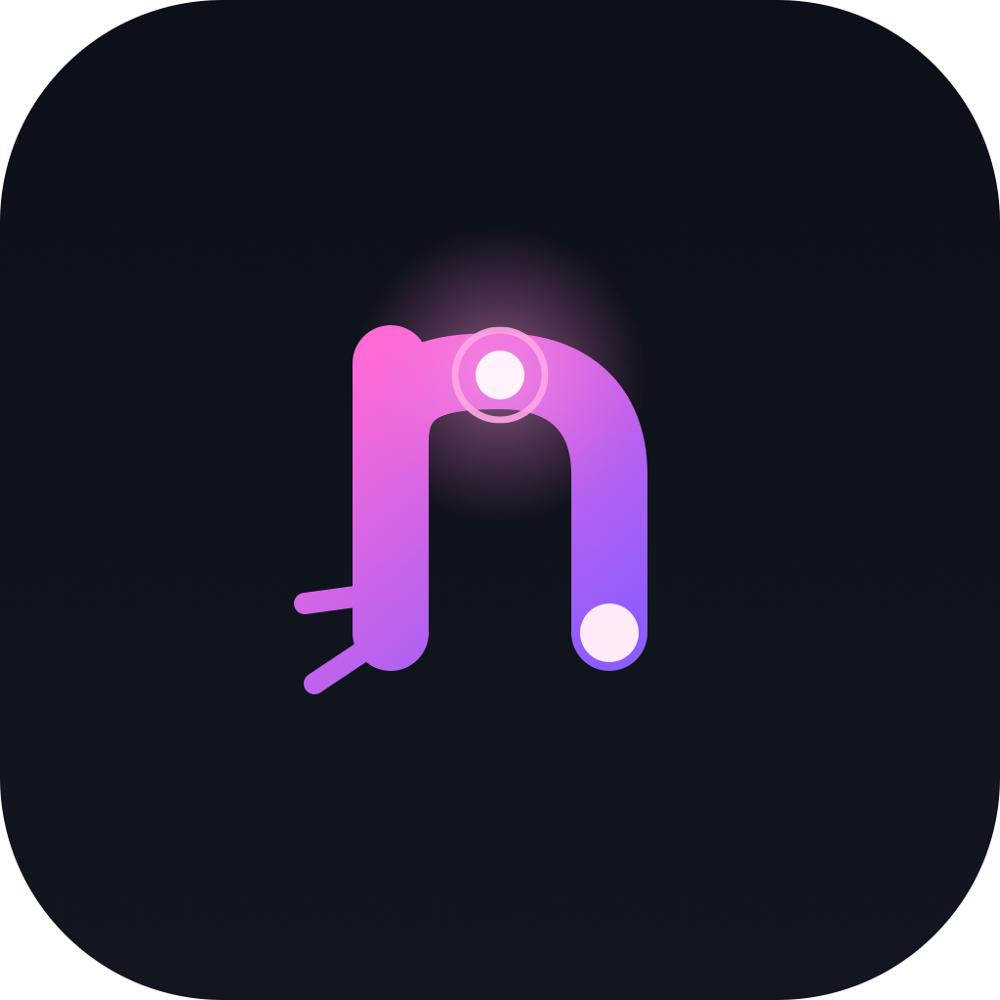
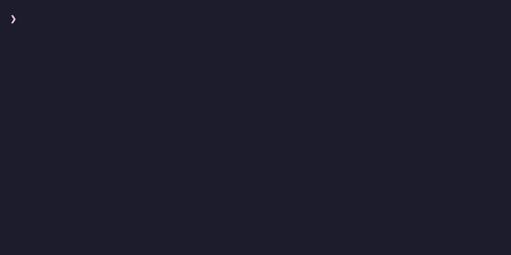

<p align="center">
  
</p>

<h1 align="center">Nerv</h1>

<p align="center">
  <strong>IDE-grade autocomplete for your terminal.</strong><br>
  No login. No AI. No telemetry. No Electron. Just one small binary and your zsh.
</p>

<p align="center">
  <a href="https://github.com/nerv-sh/nerv/actions/workflows/ci.yml"></a>
  <a href="https://github.com/nerv-sh/nerv/releases"></a>
  <a href="LICENSE"></a>
</p>

Fig gave the terminal IDE-grade autocomplete: type `git ch` and the next token
is just *there*. Then Fig was acquired, folded into Amazon Q, and the
experience got buried under a mandatory Builder ID login, AI chat, and a
multi-hundred-megabyte bundle.

Nerv digs it back out. It runs the actual Fig completion engine — the Rust
codebase AWS preserved and open-sourced — plus 700+ of the community-maintained
completion specs from [`withfig/autocomplete`](https://github.com/withfig/autocomplete),
compiled to static JSON at build time. What shipped as a desktop app with a
cloud attached is now a local daemon and a zsh widget.

**Press a key, see the next token. That's it.**

<p align="center">
  
</p>

## Highlights

- **700+ CLI specs** — `git`, `docker`, `kubectl`, `aws`, `npm`, `cargo`, `gh`,
  `brew`, `terraform`, … converted from `withfig/autocomplete` at build time.
- **Live values, not just flags** — git branches, npm scripts, kubectl
  namespaces and resources, AWS profiles and resource IDs, SSH hosts, make
  targets, man pages, zoxide history. Recovered natively in Rust; no Node, no
  JS runtime on the hot path.
- **Inline ghost text** — your most recent matching history command (like
  zsh-autosuggestions), falling back to the top spec suggestion. Right-arrow
  accepts.
- **Frecency ranking** — things you actually pick float to the top.
- **Understands your shell** — completes through `alias g=git`, behind
  `sudo` / `env` / `watch`, and on the last segment of compound lines
  (`git pull && git ch<Tab>`). Flags you already typed aren't offered twice.
- **Never stalls your typing** — the engine answers in well under a
  millisecond against a 25 ms per-keystroke budget, and a slow live completion
  (a `brew` or `docker` shell-out) runs in the background instead of freezing
  the prompt — its result lands on the next keystroke. Lazy-loaded specs,
  bounded memory.
- **Leaves no trace** — `nerv uninstall` removes every file it ever wrote.
  We treat *trace zero* as a release-blocking acceptance criterion.

## Install

Requires **macOS on Apple Silicon** and **zsh ≥ 5.8**.

```sh
brew install nerv-sh/tap/nerv
eval "$(nerv init zsh)"
```

That's the whole install. The `eval` line writes an idempotent, marker-fenced
block into your `~/.zshrc` and activates completion in the current session;
the daemon starts itself on demand, and the 700+ completion specs ship inside
the package. Type `git ` — the popup should appear. If it doesn't, run
`nerv doctor`: it checks the shell hook, the daemon, the spec cache, and the
schema version, and tells you exactly what's wrong.

> Homebrew installs don't trip Gatekeeper: `brew` doesn't quarantine its
> downloads, and the ad-hoc signature from the Rust toolchain is sufficient on
> Apple Silicon. If you download a release tarball in a browser instead, clear
> the flag once with `xattr -dr com.apple.quarantine <path>`.

## How it works

```text
 zsh ──────────────────────────────┐        ┌─ nervd (daemon) ────────────────┐
 │ ZLE widget (_nerv.zsh)          │  UDS   │ SpecRegistry — lazy, LRU-bound  │
 │   every keystroke:              ├───────►│   specs ship in the package     │
 │   nerv _complete "git ch" 6     │        │   (700+ specs, ~10 MB gzipped)  │
 │                                 │◄───────┤ generators — git branch,        │
 │ renders ghost + popup           │ 4-field│   npm scripts, … (cached, 800ms │
 │ (raw ANSI, no alternate screen) │  lines │   hard cap, off keystroke path) │
 └─────────────────────────────────┘        │ frecency ranking                │
                                            └─────────────────────────────────┘
```

- **Specs are compiled, not interpreted.** At build time a converter runs the
  TypeScript specs from `withfig/autocomplete` and emits plain JSON. At
  runtime there is no Node and no network — the daemon reads gzipped JSON off
  disk, lazily, with an LRU bound on both entry count and bytes.
- **Dynamic completions run off the keystroke path.** A subprocess
  (`git branch --list`, `cargo metadata`, …) runs on a background thread with a
  hard 800 ms cap and a 5-second cache, so a slow one never freezes the prompt —
  its result lands on the next keystroke. Well-known patterns (package.json, SSH
  config, AWS INI files) are read directly in Rust and never fork; a sandboxed
  QuickJS interpreter (~1 MB) covers the long tail of spec-defined JavaScript
  generators.
- **The widget is plain ZLE.** No alternate screen, no 24-bit color, no PTY
  interposition — just cursor save/restore and line clearing, so it stays
  inside what real terminals reliably support. An opt-in PTY mode
  (`NERV_PTY=1`) exists for bash and fish.

Measured on Apple Silicon (release build):

| Path | Latency |
|---|---|
| Engine completion, warm (p95) | 0.055 ms |
| IPC round-trip (p95) | 0.052 ms |
| Per-keystroke budget | 25 ms |
| Largest spec (aws) cold parse — once, then cached | ~250 ms |

## What Nerv will never do

Scope is a feature. Nerv has **no** AI, **no** account or login, **no**
telemetry or analytics, **no** runtime network calls, **no** auto-updater,
and **no** webview. The CLI surface is frozen at `init`, `start`, `stop`,
`doctor`, `spec list`, `uninstall` — there is deliberately no `nerv config`.
These are documented non-goals ([`PLAN.md`](./PLAN.md) §4), not a backlog.

## Configuration

One optional file, `~/.config/nerv/nerv.toml`:

```toml
[matching]
mode = "fuzzy"   # default: "prefix"
```

Prefix matching is the default and the contract: `git co` matches `commit`,
not `checkout` (checkout starts with c-h-e). Fuzzy matching is a deliberate
opt-in and only kicks in from 3 typed characters. Restart the daemon after
editing (`nerv stop && nerv start`).

## Shells and terminals

| | Status |
|---|---|
| zsh ≥ 5.8 | **Default path** — native ZLE widget |
| bash, fish | Opt-in PTY shim: `NERV_PTY=1` before `nerv init bash` / `fish` |
| iTerm2, Terminal.app (incl. tmux inside them) | **Guaranteed** — regressions block release |
| WezTerm, Alacritty, kitty | Best-effort |
| Linux, Windows | Not yet — see roadmap |

Details and the exact ANSI contract: [`docs/terminal-compat.md`](./docs/terminal-compat.md).

## Roadmap

- **v1.0** — macOS + zsh, currently in internal dogfooding. Blockers are
  written acceptance criteria, not vibes: latency budget, terminal matrix,
  error UX, trace-zero uninstall.
- **v1.x** — Linux; Windows later. Deeper recovery of the remaining
  JavaScript-closure generators.

## Contributing

Issues and discussions welcome at
[github.com/nerv-sh/nerv/issues](https://github.com/nerv-sh/nerv/issues).
Commits require a DCO sign-off (`git commit -s`). Completion behavior bugs
are the most valuable reports during the alpha — a one-liner with the exact
input and what you expected is enough.

## License

Apache-2.0 — see [`LICENSE`](./LICENSE).

Nerv stands on two upstream projects, gratefully:
[`withfig/autocomplete`](https://github.com/withfig/autocomplete) (the spec
corpus, MIT) and
[`aws/amazon-q-developer-cli-autocomplete`](https://github.com/aws/amazon-q-developer-cli-autocomplete)
(the preserved Fig engine, Apache-2.0 + MIT). See [`NOTICE`](./NOTICE).
